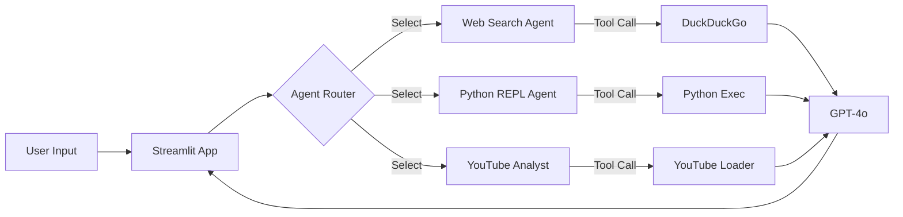

# 🤖 AI Multi-Agent Dashboard


**AI Multi-Agent Dashboard**는 최신 LLM 기술과 Agentic Workflow를 활용하여 다양한 작업을 수행하는 **올인원 AI 비서 시스템**입니다.
**LangChain**과 **LangGraph**를 기반으로 구축되었으며, 사용자의 의도에 따라 웹 검색, 코드 실행, 영상 분석 등 최적의 도구를 선택하여 문제를 해결합니다.

---

## 🌟 Key Features (주요 기능)

### 1. 🌐 Web Search Agent (웹 검색 에이전트)
- **Engine**: DuckDuckGo Search API
- **Capability**: 실시간 인터넷 검색을 통해 최신 정보를 수집하고 요약합니다.
- **Use Case**: "LangChain의 최신 버전은?", "오늘 서울 날씨 어때?"

### 2. 🐍 Python Code Interpreter (파이썬 코드 인터프리터)
- **Engine**: LangChain Experimental PythonREPL
- **Capability**: AI가 직접 파이썬 코드를 작성하고 실행(Sandbox)하여 결과를 도출합니다.
- **Use Case**: "1부터 100까지 소수의 합은?", "랜덤 데이터 생성 후 평균값 계산해줘"

### 3. 📺 YouTube Analyst (유튜브 영상 분석가)
- **Engine**: YouTube Transcript API
- **Capability**: 유튜브 URL만 있으면 자막을 자동으로 추출하여 내용을 요약하거나 질문에 답합니다.
- **Use Case**: "이 영상 3줄 요약해줘", "영상에서 언급된 핵심 개념 설명해줘"

---

## 🛠 Architecture

이 프로젝트는 **LangGraph**의 `create_react_agent`를 사용하여 **ReAct (Reasoning + Acting)** 패턴을 구현했습니다.



---

## 🚀 Installation & Usage

### 1. 환경 설정 (Prerequisites)
이 프로젝트는 Python 3.10 이상을 권장합니다.

```bash
# 프로젝트 클론 (또는 폴더 이동)
cd Portfolio_Project

# 의존성 설치 (uv 또는 pip 사용)
uv add streamlit langchain langchain-openai langchain-community langchain-experimental duckduckgo-search youtube-transcript-api pytube
```

### 2. API Key 설정
`.env` 파일을 생성하고 OpenAI API Key를 입력하세요.

```env
OPENAI_API_KEY=sk-proj-xxxxxxxxxxxxxxxxxxxxxxxx
```

### 3. 앱 실행
Streamlit을 사용하여 웹 애플리케이션을 실행합니다.

```bash
uv run streamlit run app.py
```

브라우저가 자동으로 열리며 대시보드를 사용할 수 있습니다.

---

## 👨‍💻 Developer Note
이 프로젝트는 **Agentic AI**의 가능성을 탐구하기 위해 제작되었습니다. 단순한 LLM 채팅을 넘어, 도구(Tool)를 능동적으로 사용하여 복잡한 문제를 해결하는 과정을 시각화하는 데 중점을 두었습니다.
