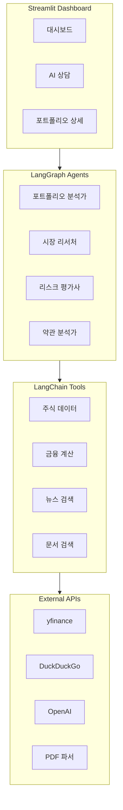

# 🏦 AI 자산 포트폴리오 분석 대시보드


**AI 기반 자산 포트폴리오 분석 대시보드**는 LLM(대형언어모델)과 에이전트 기술을 활용하여 투자 포트폴리오를 분석하고 인사이트를 제공하는 **지능형 금융 분석 시스템**입니다.

> 이 프로젝트는 **AI/LLM 기반 개발 역량**과 **금융 도메인 이해도**를 시연하기 위해 제작되었습니다.

---

## 🌟 주요 기능

### 1. 📊 포트폴리오 분석 Agent
- **실시간 가치 평가**: yfinance API를 통해 보유 종목의 현재가를 조회하고 포트폴리오 가치를 계산합니다.
- **수익률 분석**: 개별 종목 및 전체 포트폴리오의 손익을 분석합니다.
- **섹터 분산 평가**: 투자 섹터별 분포를 분석하여 분산 투자 현황을 평가합니다.

### 2. 🔍 시장 리서치 Agent
- **종목 정보 조회**: 주가, 재무지표(PER, PBR, ROE), 배당 정보 등을 조회합니다.
- **뉴스 검색**: DuckDuckGo API를 통해 관련 뉴스를 실시간으로 검색합니다.
- **시장 동향 분석**: 시장 전반의 동향과 섹터별 전망을 분석합니다.

### 3. ⚠️ 리스크 평가 Agent
- **변동성 분석**: 개별 종목 및 포트폴리오의 연환산 변동성을 계산합니다.
- **VaR (Value at Risk)**: 95% 신뢰수준에서의 일일 최대 예상 손실을 산출합니다.
- **샤프 비율 (Sharpe Ratio)**: 위험조정 수익률을 계산하여 투자 효율성을 평가합니다.
- **상관관계 분석**: 종목간 상관관계를 분석하여 분산 효과를 평가합니다.

### 4. 📜 금융 약관 분석 (RAG) [NEW]
- **PDF 문서 처리**: 금융 상품 설명서나 약관 파일을 업로드하여 분석합니다.
- **정밀 질의응답**: 사용자의 질문에 대해 문서 내용을 근거로 정확하게 답변합니다.
- **출처 제공**: 답변의 신뢰도를 높이기 위해 참조한 문서의 페이지와 내용을 함께 표시합니다.

### 5. 💬 자연어 기반 금융 Q&A
AI에게 자연어로 질문하고 전문적인 분석 결과를 받을 수 있습니다:
- "내 포트폴리오 현재 가치는?"
- "삼성전자 비중을 조절해야 할까요?"
- "반도체 업종 전망은 어때?"
- "내 포트폴리오 리스크 수준은?"

---

## 🛠 기술 스택

| 분류 | 기술 | 용도 |
|------|------|------|
| **Language** | Python 3.10+ | 백엔드 |
| **LLM Framework** | LangChain, LangGraph | AI 에이전트 구축 |
| **LLM Model** | OpenAI GPT-4o | 자연어 처리 |
| **금융 데이터** | yfinance | 실시간 주가, 재무정보 |
| **Web Framework** | Streamlit | 대시보드 UI |
| **시각화** | Plotly | 인터랙티브 차트 |
| **검색** | DuckDuckGo Search | 뉴스 검색 |

---

## 🏗 시스템 아키텍처



---

## 🚀 설치 및 실행

### 1. 사전 요구사항
- Python 3.10 이상
- OpenAI API Key

### 2. 의존성 설치

```bash
cd Projects/AI_Portfolio_Dashboard

# uv 사용 시
uv add yfinance plotly pypdf langchain-chroma sentence-transformers

# pip 사용 시
pip install yfinance plotly pypdf langchain-chroma sentence-transformers
```

### 3. 환경 변수 설정

프로젝트 루트에 `.env` 파일을 생성하고 OpenAI API Key를 입력하세요:

```env
OPENAI_API_KEY=sk-proj-xxxxxxxxxxxxxxxxxxxxxxxx
```

### 4. 앱 실행

```bash
# uv 사용 시
uv run streamlit run app.py

# 일반 Python 사용 시
streamlit run app.py
```

브라우저에서 `http://localhost:8501`로 접속하면 대시보드를 사용할 수 있습니다.

---

## 📂 프로젝트 구조

```
AI_Portfolio_Dashboard/
├── app.py                       # Streamlit 메인 앱
├── README.md                    # 프로젝트 문서
├── requirements.txt             # 의존성 목록
├── .env.example                 # 환경변수 예시
│
├── config/
│   ├── __init__.py
│   └── settings.py              # 설정 파일
│
├── agents/
│   ├── __init__.py
│   ├── portfolio_analyst.py     # 포트폴리오 분석 에이전트
│   ├── market_researcher.py     # 시장 리서치 에이전트
│   └── risk_assessor.py         # 리스크 평가 에이전트
│
├── tools/
│   ├── __init__.py
│   ├── stock_data.py            # 주식 데이터 수집 도구
│   ├── financial_calc.py        # 금융 계산 도구
│   └── news_analyzer.py         # 뉴스 분석 도구
│
├── utils/
│   ├── __init__.py
│   └── visualization.py         # Plotly 시각화 유틸
│
└── data/
    └── sample_portfolio.json    # 샘플 포트폴리오
```

---

## 📊 스크린샷

### 대시보드
- 총 투자금, 현재 가치, 수익률 등 핵심 지표 표시
- 포트폴리오 구성 파이 차트
- 종목별 손익 바 차트
- 섹터별 분포 차트

### AI 상담
- 3가지 전문 에이전트 선택 가능
- 예시 질문 버튼으로 빠른 시작
- 도구 사용 과정 실시간 시각화
- 채팅 히스토리 유지

---

## 💡 활용 시나리오

### 1. 포트폴리오 진단
```
"내 포트폴리오의 현재 상태를 분석해줘"
→ 전체 가치, 수익률, 섹터 분배 등 종합 분석 제공
```

### 2. 종목 리서치
```
"삼성전자 투자 전망과 최신 뉴스 알려줘"
→ 현재 주가, 재무지표, 관련 뉴스 요약 제공
```

### 3. 리스크 관리
```
"내 포트폴리오의 리스크 수준은 어느 정도야?"
→ 변동성, VaR, 상관관계 분석 결과 제공
```

---

## 🔧 커스터마이징

### 샘플 포트폴리오 수정
`data/sample_portfolio.json` 파일을 수정하여 자신의 포트폴리오로 변경할 수 있습니다:

```json
{
    "holdings": [
        {
            "ticker": "005930.KS",
            "name": "삼성전자",
            "quantity": 100,
            "avg_price": 75000,
            "sector": "Technology"
        }
    ]
}
```

### 지원 시장
- 한국 KOSPI: `XXXXXX.KS` (예: `005930.KS`)
- 한국 KOSDAQ: `XXXXXX.KQ` (예: `035720.KQ`)
- 미국: 심볼 그대로 (예: `AAPL`, `MSFT`)

---

## ⚠️ 주의사항

> **투자 경고**: 이 프로젝트는 교육 및 포트폴리오 목적으로 제작되었습니다. 
> 제공되는 분석 결과는 투자 조언이 아니며, 실제 투자 결정은 개인의 판단과 책임 하에 이루어져야 합니다.

---

## 👨‍💻 개발자 노트

이 프로젝트는 다음과 같은 역량을 시연합니다:

1. **AI/LLM 활용 능력**: LangChain, LangGraph를 활용한 ReAct 에이전트 구축
2. **금융 도메인 이해**: 재무지표, 리스크 지표(VaR, 샤프비율) 등 금융 개념 적용
3. **풀스택 개발**: 프론트엔드(Streamlit) + 백엔드(Python) 통합
4. **API 연동**: yfinance, DuckDuckGo, OpenAI 등 외부 API 활용
5. **데이터 시각화**: Plotly를 활용한 인터랙티브 차트

---

## 📜 라이선스

MIT License

---

## 🙏 감사의 글

- [LangChain](https://langchain.com/) - LLM 애플리케이션 프레임워크
- [Streamlit](https://streamlit.io/) - 데이터 앱 프레임워크
- [yfinance](https://github.com/ranaroussi/yfinance) - 금융 데이터 API
